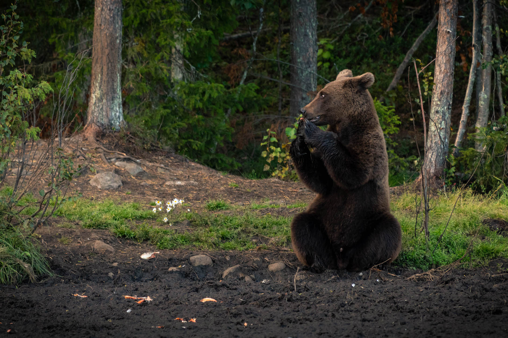
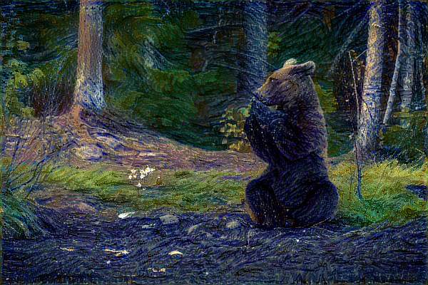

# Neural style transfer using Keras

Uses the [Art Images](https://www.kaggle.com/thedownhill/art-images-drawings-painting-sculpture-engraving) dataset from Kaggle as input.

### Download data (requires [Kaggle API](https://github.com/Kaggle/kaggle-api))
```
make download
```

## Example

### Input image


### Reference image


### Generated image

